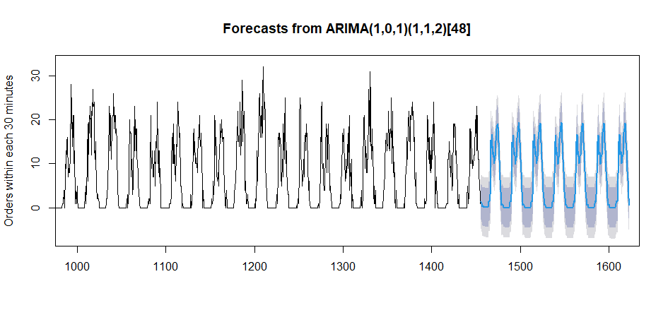

# ts-analysis-example
A brief time series analysis based on order data

Given the data, we might first want to see what it looks like

Seems like we have a clear season of 24hours and a slight echo to 7 days
We then differentiate the data according to 24h.

Seems like the data is quite nice for later analysis.
We're using a SARIMA(p,d,q)(P,D,Q)[s] model.

For s we already chose 24 and since we differented once for good result we can assuma D=1

The rest of the values can be drawn from the graph of ACF and PACF.
- for p the value might be 1 since we see two remarkable spikes on PACF spike sets. The first one means the value itself. For P the value migh as well be 1 since we're seeing the same effect with seasonal spikes
- for q and Q we see as well two remarkable spikes in ACF both single and seasonal

However, the model build on these values reveals that q =1 might be better since ma2 explationary variable is small.
Therefore we use SARIMA(1,0,1)(1,1,2)[24]

This model gives following visual forecasts

