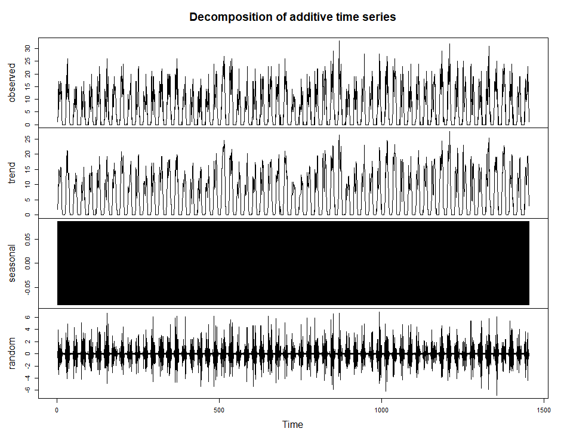
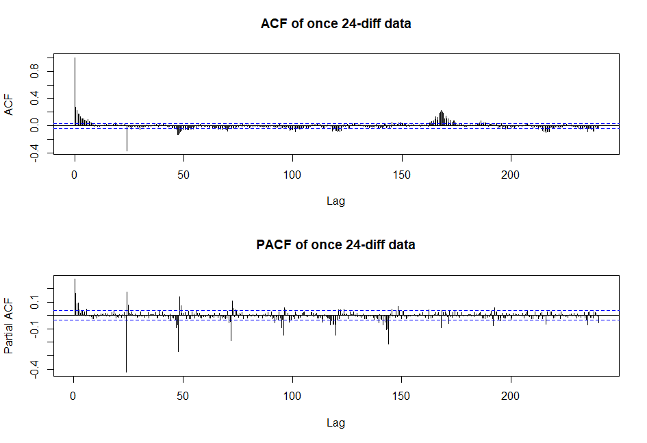

# ts-analysis-example
A brief time series analysis based on order data

Given the data, we might first want to see what it looks like

Seems like we have a clear season of 24hours and a slight echo to 7 days
We then differentiate the data according to 24h.

Seems like the data is quite nice for later analysis.
We're using a SARIMA(p,d,q)(P,D,Q)[s] model
